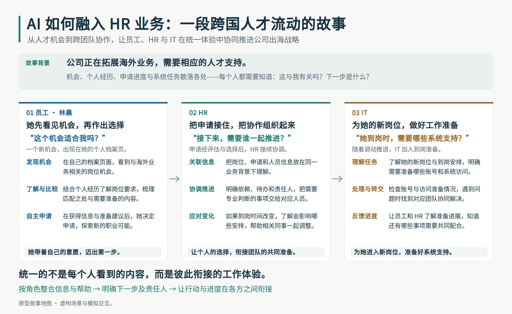

# Global Mobility Assistant

**Learning prototype** · Role-scoped AI copilot for cross-border employee moves.
Not an SAP official product · Fictional data · Simulated execution.

一个学习性原型 · 面向跨境员工调动的权限角色隔离 AI 助手。
非 SAP 官方产品 · 虚构数据 · 模拟执行。

---

## 查看演示 · View the demo

- **英文版 · English:** https://serene-gao-byte.github.io/global-mobility-assistant/prototype/index.html
- **中文版 · 中文:** https://serene-gao-byte.github.io/global-mobility-assistant/prototype/zh/index.html

**仓库 · Repository:** https://github.com/serene-gao-byte/global-mobility-assistant

---

## 项目背景 · Project background

一家中国新能源集团正在拓展沙特市场。员工先在个人档案页发现相关机会，了解岗位要求后自主决定申请。随着申请与调动流程推进，HRBP 协调业务安排，IT 在相应阶段提供账号与系统支持。

本项目探索如何将分散的信息与流程组织为统一的工作体验：员工、HR 与 IT 围绕同一个业务方向，获得各自需要的信息和帮助，明确下一步与接手责任。统一体验不意味着共享全部信息或权限；关键判断与审批仍由相应人员承担。

A Chinese renewable-energy group is expanding into Saudi Arabia. An employee discovers an opportunity through her profile and chooses whether to apply. As the application and move progress, HR coordinates business arrangements and IT prepares the required account and system support. The prototype connects these role-specific experiences while leaving key decisions and approvals with the responsible people.

### 故事地图 · Story map

**AI 如何融入 HR 业务：一段跨国人才流动的故事**

从人才机会到跨团队协作，让员工、HR 与 IT 在统一体验中协同推进公司出海战略。



---

## 产品思路 · Product thinking

**这个原型不是"让 AI 做得更多",而是"让 AI 知道在哪里帮、在哪里停手交接"。** 三处刻意的暂停贯穿演示:

**This prototype is not about "AI doing more" — it's about AI knowing where to help, and where to pause and hand off.** Three intentional pauses run through the demo:

| # | 场景 · Scene | AI 做什么 · What AI does | 谁拍板 · Who decides |
|---|---|---|---|
| 1 | 员工问"我该接这个岗吗?" · Employee: *"should I take this role?"* | 摆出利弊、匹配、差距 · Lays out trade-offs, matches, gaps | **员工本人** · The employee — life-stage fit isn't in the data |
| 2 | HR 路由一位专家 · HR routes a specialist | 按 责任→资质→授权→产能 推荐 · Recommends by responsibility → qualification → authorization → capacity | **HRBP** · HR sends the request; the agent only recommends |
| 3 | IT 观察到身份异常 · IT observes an identity anomaly | 描述所见、路由至治理团队 · Describes what it sees, routes to governance | **身份治理 / 合规团队** · The agent does not conclude a root cause or propose an operation |

Same event, three views, cross-tab state synced in real time. 同一事件，三个视角，跨标签页实时同步。

---

## 关键设计决策 · Key design decisions

**1）异常按角色分流与交接**

同一异常,不同角色看到不同信息:员工看到进度,HR 看到需协调的事项,IT 看到技术线索;超出各自判断范围的,交由治理团队接手。此设计针对信息过载与责任不清:各角色仅获取与其职责相关的信息;转交不等于问题已解决——接手方获得完整上下文,其余各方也清楚下一步由谁负责。

**2）操作可行性的统一判定**

改动关键日期(如调动生效日)会牵动一连串已确认的事项,因此系统用一套统一规则判断"能否提交、能否执行"——无论在对话中询问还是点击按钮,结果始终一致,不会出现按钮与提示相互矛盾。关键日期变更后,先前的确认自动失效:须生成新版本、经相关人重新确认并通过审批,方可执行。系统以当前业务状态为依据,同时呈现暂停原因与恢复步骤。

*Anomalies are handed off by role — the employee sees progress, HR sees what needs coordination, IT sees technical clues — and anything beyond a role's scope is routed to the governance team, so the recipient gets full context while a handoff is never mistaken for a resolution. A single shared rule gates chat, buttons, and submission alike, so feasibility never has two answers; a key-date change invalidates prior sign-offs and blocks execution until a new version is re-confirmed and approved.*

### 代码入口与实现边界 · Implementation pointers and scope

- **统一判定：**[`prototype/zh/hrbp.html`](prototype/zh/hrbp.html) 中的 `computeSubmitGate()` 供对话、按钮与提交处理使用；改期时清除旧确认和审批状态，执行处理另行检查批准状态。英文页采用相同设计。
- **按角色交接：**见 [`employee.html`](prototype/zh/employee.html)、[`hrbp.html`](prototype/zh/hrbp.html)、[`it.html`](prototype/zh/it.html) 中的进度提示、交接摘要与治理团队转交说明；共享状态位于 [`prototype/shared/state.js`](prototype/shared/state.js)。

当前通过前端角色视图与本地状态模拟上述交互，未连接真实 SAP 系统，也未实际执行 RBP 校验或 IPS / Work Zone 授权同步。角色视图不等于服务端访问控制；确认、审批、执行和转交均为模拟。真实集成仍需由业务服务执行权限、审批和结果核验。

These interactions are simulated through role views and local state. The prototype does not connect to SAP, validate RBP, or run IPS / Work Zone provisioning. Role views are not server-side access control; confirmation, approval, execution, and handoff are simulated.

详细设计材料：[`docs/security-agent-design.md`](docs/security-agent-design.md)。

---

## 本地启动 · Run locally

**零依赖 · 无需 build 步骤 · No dependencies, no build step.**

```bash
git clone https://github.com/serene-gao-byte/global-mobility-assistant.git
cd global-mobility-assistant
```

任选一种方式打开 · Open it either way:

**方式一 · 直接双击 · Double-click**

在文件管理器中双击 `prototype/index.html`(英文)或 `prototype/zh/index.html`(中文) —— 浏览器打开即可看到 Landing 页。

**方式二 · 起一个本地静态服务器 · Local static server**(推荐 · 避免个别浏览器对 `file://` 的限制)

```bash
# Python 3
python -m http.server 8000
# 然后打开 http://localhost:8000/prototype/index.html

# 或用 Node · or with Node
npx serve
```

**浏览体验建议 · Viewing tip:** 从 Landing 页 Ctrl-Click 三个角色卡片,在三个标签页里同时打开员工/HRBP/IT 三个视图 —— 跨标签页的业务状态会实时同步(通过 `localStorage`),同一个事件从三个视角看会同步演进。手机端可以单角色浏览,布局已适配窄屏。
Ctrl-Click the three role cards on the Landing page to open Employee / HRBP / IT side by side; state syncs across tabs via `localStorage`. Mobile is supported single-role; the layout adapts to narrow screens.

---

## 目录结构 · Repository layout

```
assets/
└── story-map.png    Story map · 故事地图

prototype/          Runnable prototype — open index.html to start
├── index.html      Landing page · 3 role entries (English)
├── employee.html   Employee (Lin Chen) view · 6 steps
├── hrbp.html       HRBP (Mira Klein) view · 6 steps
├── it.html         IT Admin (Tom Reeves) view · 5 steps
├── shared/         SAP Horizon design tokens, shell, Joule panel, cross-tab state
├── data/           Per-role fixtures (fictional)
└── zh/             Chinese localized mirror · 中文本地化镜像

docs/               Design + narrative documents
├── security-agent-design.md   ★ Safe autonomous action · Agent 设计说明
├── narrative.md               Story · 90s / 60s / 30s versions
├── scenario.md                3-minute demo script, shot by shot
├── role-boundaries.md         Who sees what, who does what
├── tech-modules.md            Support-perspective deep dive on SAP SF modules
├── changelog.md               Iteration history (v1 → v7)
├── evaluation.md              Acceptance criteria + reference anchors
└── evidence-register.md       Per-card capability source mapping
```

---

## Boundaries · 边界

- No real model, no real SAP tenant, no database, no network calls. 无真实模型、无真实 SAP 租户、无数据库、无网络调用。
- All names, IDs, dates, and figures are fictional. 所有姓名、ID、日期、数字均为虚构。
- Native AI features are referenced but not rebuilt. 原生 AI 能力被引用但未重建。
- Compliance-related items (data protection, retention, cross-border processing, local employment rules) are shown as items requiring qualified specialists to evaluate — the tool does not draw legal conclusions. 合规相关事项呈现为需要有资质的专家评估的项,工具不下法律结论。
- Design tokens (colors, font stack) are extracted from public SAP artifacts for visual reference; no SAP brand assets are redistributed. 设计 token 仅作视觉参考,不再分发任何 SAP 品牌素材。

---

## Security note · 安全说明

This prototype uses `innerHTML` with an `esc()` helper for HTML-escaping. Data is entirely embedded fictional content with no external inputs. If ever extended to accept real data or deployed as a real product, `innerHTML` patterns should be replaced with `textContent` / DOM APIs or a sanitizer library.

本原型使用 `innerHTML` 配合 `esc()` 做 HTML 转义。数据全部为内嵌虚构内容,无外部输入。若将来接入真实数据或作为真实产品部署,应将 `innerHTML` 模式替换为 `textContent` / DOM API 或引入 sanitizer 库。
